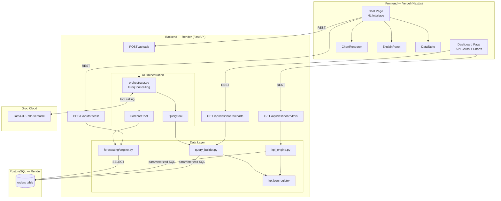
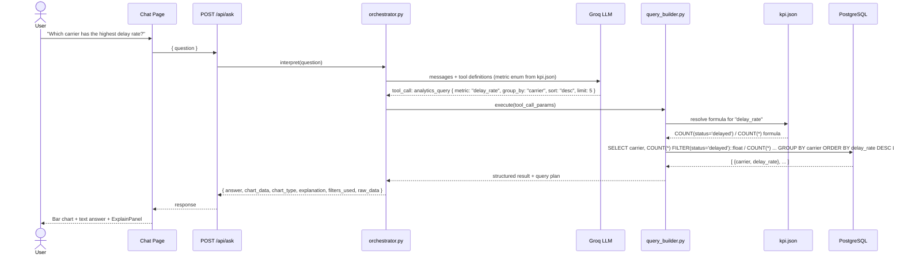
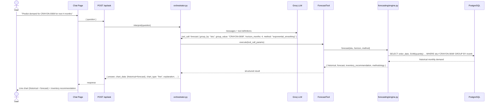
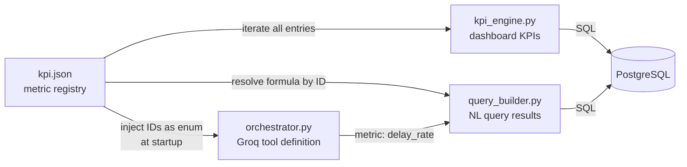
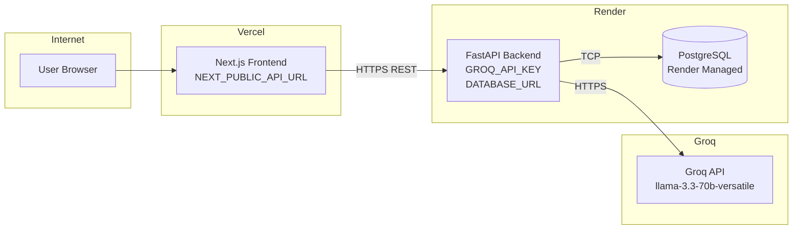

# Architecture: AI-Powered Logistics Analytics Dashboard

## Overview

A full-stack web application that combines a traditional analytics dashboard with a natural-language AI interface, operating on a unified logistics dataset. The system supports three levels of intelligence: descriptive (KPI dashboards), diagnostic (NL queries), and predictive (demand forecasting).

---

## Tech Stack

| Layer | Technology | Hosting |
|---|---|---|
| Frontend | Next.js 14 (App Router, TypeScript, Tailwind CSS) | Vercel |
| Backend | FastAPI (Python 3.11) | Render |
| Database | PostgreSQL | Render Managed Postgres |
| AI Orchestration | Groq API — `llama-3.3-70b-versatile` (tool calling) | Groq Cloud |
| Charts | Recharts | — |
| Forecasting | statsmodels (Exponential Smoothing) + pandas | — |

---

## System Architecture



---

## Data Flow: Natural Language Query



---

## Data Flow: Forecasting



---

## kpi.json as Unified Metric Registry

This is the key architectural decision that guarantees **formula consistency** between the dashboard and the AI chat interface.



**The guarantee:** both the dashboard KPI card and the AI chat answer for "delay rate" resolve the formula from the same JSON entry. There is no possibility of formula drift between the two interfaces.

Adding a new KPI requires only editing `kpi.json` — no Python code changes.

---

## Project Structure

```
spaceship/
├── ARCHITECTURE.md
├── product/                        # Spec + dataset
│   ├── mock_logistics_data.csv
│   ├── logistics-spec.docx.md
│   └── Coding_assignment.docx.md
│
├── backend/                        # FastAPI
│   ├── main.py                     # App entry point, startup hooks
│   ├── config/
│   │   └── kpi.json                # KPI formula registry (single source of truth)
│   ├── db/
│   │   ├── connection.py           # SQLAlchemy engine + session
│   │   ├── models.py               # Order ORM model
│   │   ├── kpi_engine.py           # Reads kpi.json → runs KPI queries
│   │   ├── query_builder.py        # Translates tool params + kpi.json → parameterized SQL
│   │   └── seed.py                 # Loads logistics.csv → PostgreSQL
│   ├── ai/
│   │   ├── orchestrator.py         # Groq tool calling; injects kpi.json IDs at startup
│   │   └── tool_schemas.py         # Groq tool definitions (analytics_query, forecast)
│   ├── forecasting/
│   │   └── engine.py               # Exponential Smoothing via statsmodels
│   ├── routers/
│   │   ├── dashboard.py            # GET /api/dashboard/kpis, /charts
│   │   ├── ask.py                  # POST /api/ask
│   │   └── forecast.py             # POST /api/forecast
│   ├── schemas/
│   │   └── responses.py            # Pydantic response models
│   ├── requirements.txt
│   └── .env.example
│
└── frontend/                       # Next.js 14
    ├── app/
    │   ├── page.tsx                # Dashboard
    │   ├── chat/
    │   │   └── page.tsx            # NL Chat interface
    │   └── layout.tsx
    ├── components/
    │   ├── KPICard.tsx
    │   ├── ChartRenderer.tsx       # Auto-selects chart type from API response
    │   ├── ExplainPanel.tsx        # Filters, metric, dimensions, query plan
    │   └── DataTable.tsx           # Raw data view
    ├── lib/
    │   └── api.ts                  # Typed API client
    ├── package.json
    └── .env.example
```

---

## API Contract

### `GET /api/dashboard/kpis`
```json
[
  { "id": "total_orders",          "label": "Total Orders",          "value": 165,  "format": "integer" },
  { "id": "delivered_orders",      "label": "Delivered Orders",      "value": 139,  "format": "integer" },
  { "id": "delayed_orders",        "label": "Delayed Orders",        "value": 18,   "format": "integer" },
  { "id": "on_time_delivery_rate", "label": "On-Time Delivery Rate", "value": 84.2, "format": "percent" },
  { "id": "avg_delivery_days",     "label": "Avg Delivery Time",     "value": 4.1,  "format": "days"    }
]
```

### `POST /api/ask`
**Request:** `{ "question": "Which carrier has the highest delay rate?" }`

**Response:**
```json
{
  "answer": "DHL has the highest delay rate at 23.5% across 17 orders.",
  "chart_type": "bar",
  "chart_data": {
    "labels": ["DHL", "USPS", "UPS", "FedEx", "OnTrac"],
    "datasets": [{ "label": "Delay Rate (%)", "data": [23.5, 18.2, 14.1, 11.3, 8.7] }]
  },
  "explanation": {
    "metric": "delay_rate",
    "group_by": "carrier",
    "filters": {},
    "query_plan": "COUNT(status='delayed') / COUNT(*) grouped by carrier, ordered desc"
  },
  "filters_used": {},
  "raw_data": [
    { "carrier": "DHL",  "delay_rate": 23.5, "total_orders": 17 }
  ]
}
```

### `POST /api/forecast`
**Request:** `{ "group_by": "sku", "group_value": "CRAYON-0008", "horizon_months": 4, "method": "exponential_smoothing" }`

**Response:**
```json
{
  "historical": [{ "month": "2025-01", "quantity": 3 }, ...],
  "forecast":   [{ "month": "2026-06", "quantity": 4, "lower": 2, "upper": 6 }, ...],
  "inventory_recommendation": "Plan for ~4 units/month. Buffer stock of 6 units recommended.",
  "methodology": "Holt-Winters Exponential Smoothing (additive) on 12 months of historical data."
}
```

---

## kpi.json Schema

```json
[
  {
    "id": "total_orders",
    "label": "Total Orders",
    "description": "Count of all orders in the dataset",
    "aggregation": "count",
    "field": "*",
    "filters": {},
    "format": "integer"
  },
  {
    "id": "delivered_orders",
    "label": "Delivered Orders",
    "aggregation": "count",
    "field": "*",
    "filters": { "status": "delivered" },
    "format": "integer"
  },
  {
    "id": "delayed_orders",
    "label": "Delayed Orders",
    "aggregation": "count",
    "field": "*",
    "filters": { "status": "delayed" },
    "format": "integer"
  },
  {
    "id": "on_time_delivery_rate",
    "label": "On-Time Delivery Rate",
    "aggregation": "ratio",
    "numerator":   { "field": "*", "filters": { "status": "delivered" } },
    "denominator": { "field": "*", "filters": {} },
    "format": "percent"
  },
  {
    "id": "avg_delivery_days",
    "label": "Avg Delivery Time",
    "aggregation": "avg_date_diff",
    "field": "delivery_date - order_date",
    "filters": { "delivery_date__not_null": true },
    "format": "days"
  }
]
```

---

## Deployment Architecture



---

## Security Notes

- No raw AI-generated SQL is executed. Groq returns structured parameters only; `query_builder.py` generates all SQL using parameterized queries.
- All metric identifiers are validated against the `kpi.json` registry before query execution.
- All dimension and filter values are validated against allowlists (enums) before use in SQL.
- Secrets (`GROQ_API_KEY`, `DATABASE_URL`) are environment variables — never committed to the repository.

---

## Key Design Decisions & Tradeoffs

| Decision | Rationale |
|---|---|
| PostgreSQL over SQLite | Production-grade, hosted on Render, future-proof for concurrent access |
| `kpi.json` registry drives both dashboard and AI | Guarantees formula consistency; decouples metric definitions from code |
| Groq `llama-3.3-70b-versatile` | Best tool-calling support in Groq's catalog; fast inference |
| No AI-generated SQL | Eliminates SQL injection risk; enforces structured computation |
| Recharts over Plotly | Lighter bundle, no SSR issues in Next.js App Router |
| "On-time" = `status='delivered'` | Dataset has no SLA/expected-date field to compare against |
| Exponential Smoothing for forecasting | Simple, interpretable, works well on short time series |
| No auth | Dataset is not sensitive; simplifies deployment within time budget |

---

## Assumptions & Limitations

- **On-time definition:** No SLA or expected-delivery-date is present in the dataset. "On-time" means `status = 'delivered'`.
- **In-transit orders** are excluded from average delivery time (no `delivery_date`).
- **NL query scope:** Only metrics registered in `kpi.json` are supported. Queries outside this set return an "unsupported metric" response.
- **Forecast horizon:** Reliable up to 6 months given ~12 months of historical data per SKU.
- **Dataset size:** 165 rows. Forecasting per-SKU may have limited historical points; product-category-level forecasts are more reliable.

---

## Future Improvements

- Query history with bookmarking
- Response caching (Redis) for repeated NL queries
- Expanding `kpi.json` with cost and margin metrics
- Authentication (NextAuth.js)
- Docker Compose for local development
- Unit tests for `query_builder.py` and `kpi_engine.py`
- WebSocket streaming for AI responses
